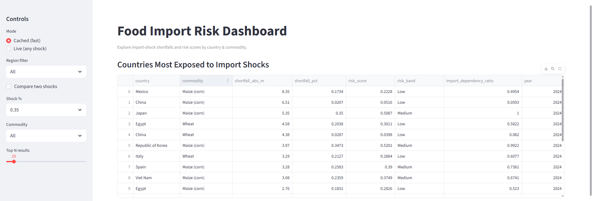
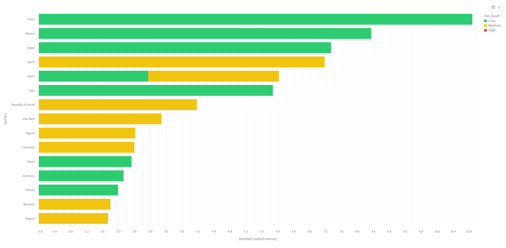
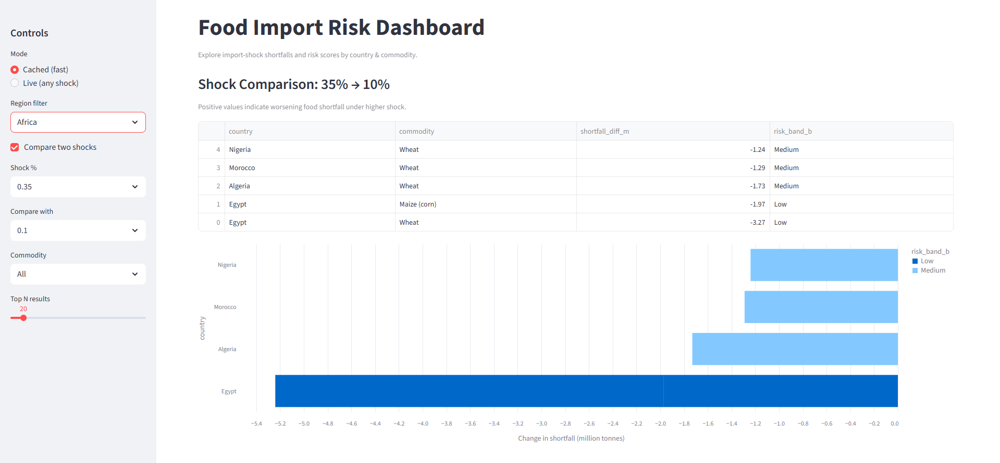
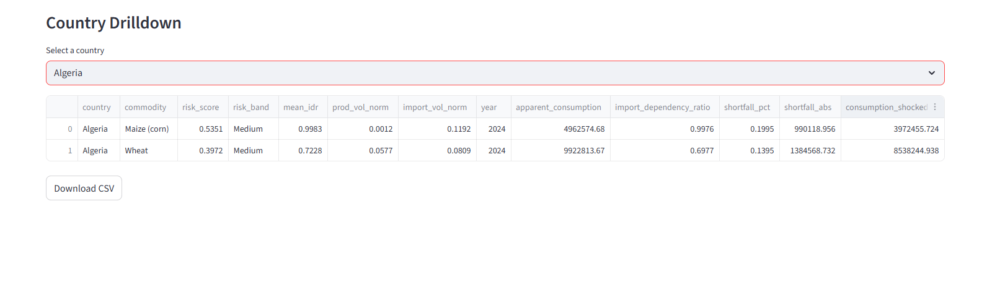

# Food Import Risk Dashboard

## What this project is about

Many countries depend on food imports.
When imports are disrupted (wars, climate shocks, trade bans), food supply can drop quickly.

This project answers one simple question:

> **If food imports fall, which countries are most exposed, and by how much?**

The dashboard simulates import shocks (10%, 20%, 35%, 50%) and shows:

* how much food supply is lost
* which countries are structurally fragile
* how risk changes as shocks get worse

---

## What the dashboard shows

### 1. Import shock simulation

For each country and commodity:

* current production
* imports and exports
* apparent consumption
* how much consumption is lost under an import shock

Example:

> A 35% import shock means 35% of imports disappear, not total supply.

---

### 2. Risk score (structural risk)

Each country–commodity pair has a risk score (0–1) based on:

* how dependent the country is on imports
* how volatile imports are
* how volatile production is

Risk bands:

* **Low**
* **Medium**
* **High**

This separates:

* *big shortfall but resilient countries*
* *smaller shortfall but fragile countries*

---

### 3. Top risk table

Countries are ranked by:

* **absolute food shortfall** (in million tonnes)

This answers:

> “Where is the biggest food gap if imports fail?”

---

### 4. Country drilldown

Pick a country and see:

* all its major commodities
* risk score per commodity
* import dependence
* how shocks affect consumption

This makes the dashboard usable for policy and analysis, not just charts.

---

### 5. Comparison mode (shock vs shock)

You can compare two shocks (e.g. 20% vs 35%).

This shows:

* how much worse things get as shocks increase
* which countries deteriorate fastest

Example:

> “At 20% shock, the shortfall is manageable.
> At 35%, it becomes critical.”

---

### 6. Region filters

You can focus on:

* **Africa only**
* **EU only**
* or **All countries**

This helps regional analysis and storytelling.

---

## Data sources

* **FAOSTAT** (production, trade, consumption)
* Latest available global year in the dataset

Data is processed and cleaned into:

* production tables
* trade tables
* merged country–commodity snapshots

---

## How the system is built

### Backend (FastAPI)

* `/risk/top`: live simulation
* `/risk/top_cached`: fast precomputed results
* `/risk/country/{country}`: country drilldown
* cached parquet files for common shocks

### Frontend (Streamlit)

* interactive dashboard
* charts and tables
* comparison and region filters
* CSV export

---

## How to run locally

### 1. Start the API

```bash
uvicorn src.api:app --reload
```

### 2. Start the dashboard

```bash
streamlit run app.py
```

Then open:

```
http://localhost:8501
```

---

## How to read the results 

Example:

**Japan - Maize**

* import dependency ≈ 100%
* 35% shock means ~35% of maize supply disappears
* ~5.3 million tonnes shortfall
* **Medium–High risk**

Meaning:

> Japan’s food system works normally,
> but it is very fragile if imports fail.

---

## Screenshots

### Main view (table)


### Exposure chart


### Shock comparison


### Country drilldown

