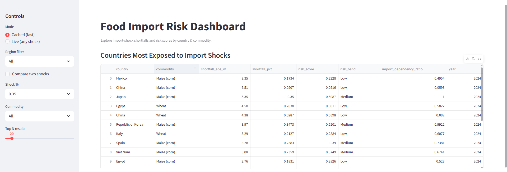
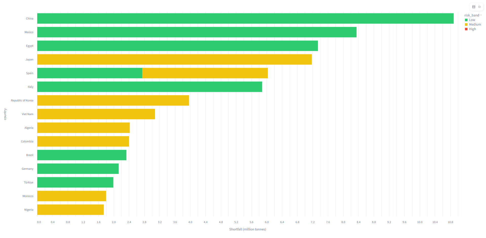
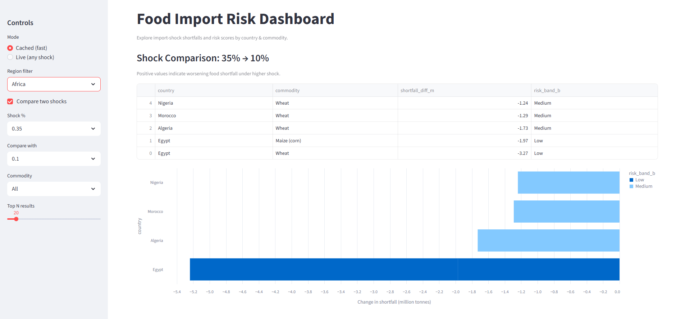
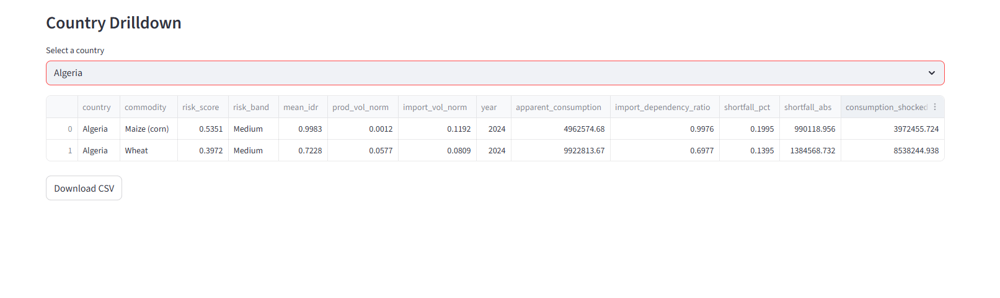

# Food Import Risk Dashboard

Many countries cannot feed themselves without imports. When those imports stop, food disappears fast.

This project answers one question:

> **If food imports fall, which countries run short first, and by how much?**

You pick a shock size. The dashboard shows you the damage.

**[Open the live dashboard](https://food-import-risk-dashboard.streamlit.app)**

*If it shows a sleep screen, click the wake button. It takes about 30 seconds. Free hosting puts apps to sleep when nobody has visited for a while.*



---

## What it is not

It does not predict anything. There is no forecast in here.

It is a what-if tool. You set the shock, it works out the consequence. That is on purpose, because nobody can forecast a trade disruption, but everybody can prepare for one.

---

## What you can do with it

### 1. Simulate a shock

Choose 10%, 20%, 35% or 50%.

A 35% shock means 35% of imports disappear. Not 35% of all food, only the imported part. That distinction matters and the dashboard keeps it clear.

You get the shortfall two ways:

- in million tonnes
- as a share of what the country normally eats

### 2. See who is structurally fragile

Every country and commodity pair gets a risk score from 0 to 1, built from three things:

- how much of its supply comes from imports
- how much those imports swing year to year
- how much its own production swings year to year

Scores group into **Low**, **Medium** and **High**.

This separates two very different situations: a country that can absorb a shock, and a country that is fragile even when things look fine.

### 3. Rank the most exposed countries

Sorted by absolute shortfall in million tonnes.

> Where does the biggest food gap open up if imports fail?

### 4. Look at one country closely

Pick a country and see every major commodity, its risk score, its import dependency, and how each shock size would hit it.

### 5. Compare two shocks side by side

For example 10% against 35%.

This shows how fast things get worse, which is more useful than any single number.

> At 10%, most systems absorb it.
> At 35%, it becomes serious.

### 6. Filter by region

Africa, the EU, or everywhere.

---

## A worked example

**Japan, maize**

- imports supply almost 100% of it
- a 35% import shock removes about 35% of maize supply
- that is roughly 5.3 million tonnes gone
- risk score lands in Medium to High

In simple terms:

> Japan's food system works perfectly in normal conditions. It is very fragile if imports are disrupted.

That is the whole point of the project. A country can look fine and still be exposed.

---

## Screenshots

### Countries most exposed
Ranked by how much food goes missing, in million tonnes.


### Exposure under a single shock
How the shortfall is spread across countries.



### Comparing two shocks
How much worse things get between one shock level and the next.



### One country, every commodity
Risk score and import dependency for each crop.



---

## Where the data comes from

**FAOSTAT.** Production, trade and consumption figures from the UN Food and Agriculture Organization. Free and open, so anyone can check this.

The raw data is cleaned and merged into one row per country and commodity, then the shocks are applied.

---

## How it is put together

Data preparation happens in the notebooks. The cleaned results are saved as parquet files and published through **GitHub Releases**, and the dashboard loads them straight from there.

That means no database and no server. It runs free, and it stays fast because the data is cached after the first load.

You can export any table to CSV from inside the dashboard.

---

## What this cannot tell you

**It is one year of data.** This is a snapshot of exposure as things stand, not a trend. It cannot tell you whether a country is getting more or less fragile over time.

**I chose the risk score weights myself.** The three inputs are combined by my judgement about what makes a food system fragile. They are not fitted to anything, and I have not checked the ranking against real food crises.

**Imports are treated as one block.** In reality a country importing from five suppliers is safer than one importing the same volume from a single supplier. The data I used does not let me see that.

**No prices.** A shortfall in tonnes is not the same as a shortfall people can feel. Price effects depend on substitution, stocks and purchasing power, none of which are in here.

---

## What I would do next

1. **Run it across several years** so exposure becomes a trend instead of a snapshot.
2. **Test the risk score** against countries that actually had food crises, and see whether it ranked them highly beforehand.
3. **Break imports down by supplier country**, so concentration risk shows up.
4. **Connect it to prices.** In a later project I found that naira depreciation predicts Nigerian food price spikes better than any price indicator. Import dependency and currency weakness are the same story from two directions, and they belong in one view.

---

## Running it yourself

```bash
git clone https://github.com/HalimatFakorede/food-import-risk-dashboard
cd food-import-risk-dashboard

pip install -r requirements.txt
streamlit run app.py
```

Then open http://localhost:8501

No database or API keys needed. The data downloads itself.

---

## What is in here

```
app.py          the Streamlit dashboard
src/            shock simulation logic
notebooks/      data cleaning and shock generation
assets/         screenshots used in this README
```

---

## Related work

**[Nigeria Yield Gap Explorer](https://github.com/HalimatFakorede/nigeria-yield-gap)**, why Nigerian crop yields are not improving

**[Nigeria Food Price Early Warning System](https://github.com/HalimatFakorede/nigeria-food-price-early-warning)**, which staple foods are about to get expensive

---

Built by [Halimat Fakorede](https://github.com/HalimatFakorede) · [LinkedIn](https://linkedin.com/in/halimatfakorede)
